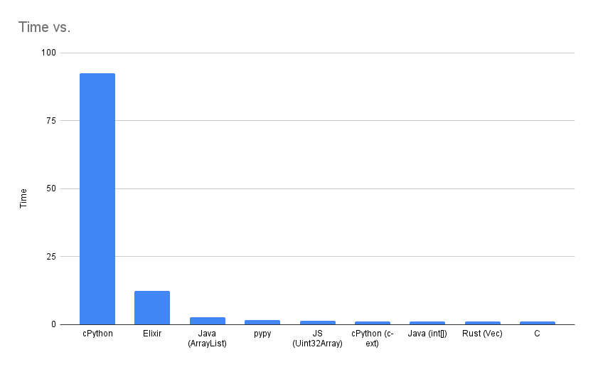
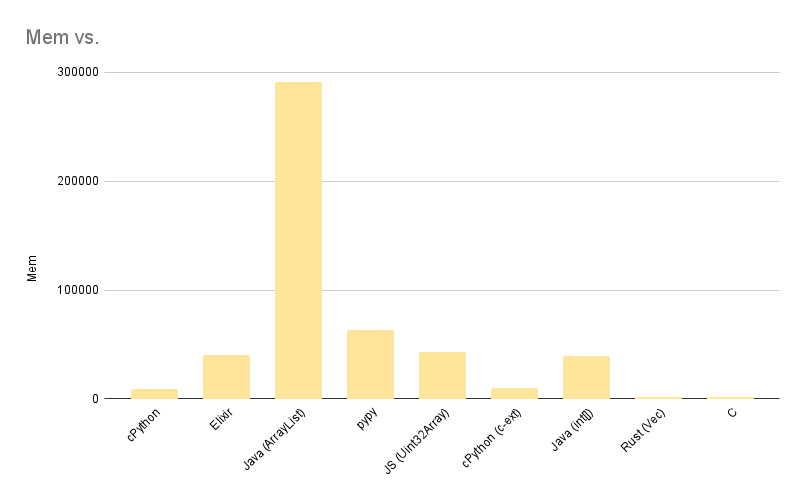

performance
========

|                  | Time  | Mem    |
|------------------|-------|--------|
| cPython          | 92.33 | 9568   |
| Elixir           | 12.28 | 40548  |
| Java (ArrayList) | 2.72  | 290828 |
| pypy             | 1.54  | 63360  |
| JS (Uint32Array) | 1.26  | 43356  |
| cPython (c-ext)  | 1.22  | 9720   |
| Java (int[])     | 1.22  | 39664  |
| Rust             | 1.15  | 1948   |
| C                | 1.15  | 1584   |

